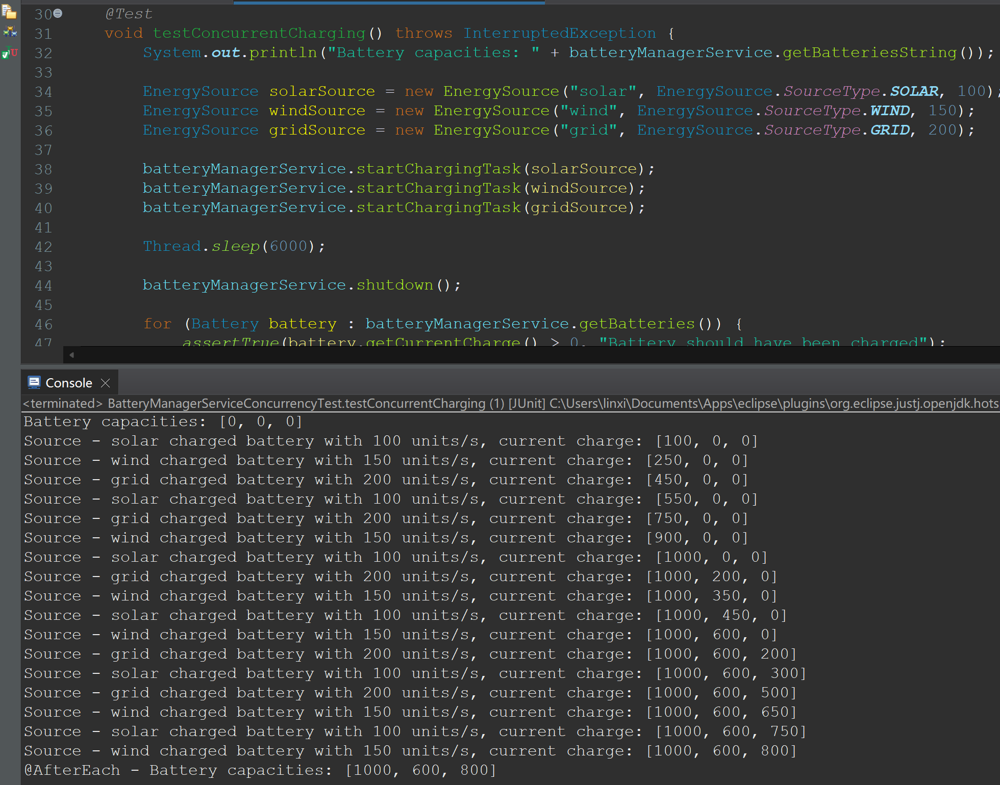

# HA 03: Concurrency
Answers:
- provide a comparison of the Concurrency models (Procs & Cons)
  - Threads 
    Threads are lightweight units of execution within a process that share the same memory space, making communication and data sharing efficient. They benefit from native support in many programming languages and operating systems, allowing for easy implementation. However, managing threads can be complex due to issues like race conditions and deadlocks, and debugging multi-threaded applications can be challenging because of their non-deterministic behavior.
  - Processes 
    Processes are independent units of execution that have their own memory space, providing isolation and enhancing security and stability; a failure in one process does not affect others. They are well-suited for multi-core systems, allowing for concurrent execution. However, processes have a higher overhead due to memory isolation, and inter-process communication can be more complex and slower compared to the shared memory model used in threads.
- explain differences between Concurrency vs Parallelism
  - Concurrency 
  Concurrency and parallelism are two distinct concepts in computing that relate to executing multiple tasks. Concurrency refers to the ability of a system to manage multiple tasks simultaneously, allowing them to make progress without necessarily running at the same time. It often involves interleaving tasks on a single processor or using multithreading, making it particularly useful for I/O-bound tasks, such as handling user inputs or waiting for network responses. However, concurrency introduces complexity in managing shared resources and preventing issues like race conditions.
  - Parallelism 
  Parallelism, on the other hand, is the simultaneous execution of multiple tasks across multiple processors or cores. It is geared toward speeding up computations by dividing tasks into smaller, independent sub-tasks that can be executed at the same time, making it ideal for CPU-bound tasks, like complex calculations or data processing. While parallelism can significantly enhance performance, it also presents challenges in coordinating tasks and managing data dependencies to ensure correct results. In essence, concurrency focuses on managing tasks over time, while parallelism emphasizes executing tasks at the same time.
- explain the usage of Blocking Concurrency Algorithms and Non-blocking Concurrency Algorithms
  - Blocking Concurrency 
  Blocking concurrency algorithms are frequently used in scenarios where tasks need to wait for certain conditions or resources to become available. This approach is particularly useful in multi-threaded applications, such as those you might encounter in Java development, where threads can block while waiting for I/O operations or for access to shared resources like databases. Blocking algorithms are ideal for applications involving file handling or network communication, where it is common for a thread to pause execution until the required resource is ready.
  - Non-blocking Concurrency 
  Non-blocking concurrency algorithms are applied in environments that demand high performance and responsiveness, such as real-time systems or high-frequency trading applications. In these scenarios, allowing multiple tasks to proceed without waiting for locks or resources helps minimize latency and enhances throughput. This is especially valuable in applications where you're implementing concurrent data structures or dealing with scenarios that involve a high level of contention among threads. By using non-blocking techniques, you can achieve better CPU utilization and maintain system performance under heavy load.

## Role Distribution and Screencast Link
Team Video: [Screencast Link]()

- Yanal Al Halabi, 7221683, I mainly worked on the Battery class and contributed to the BatteryManagerService.
  - [Screencast Link](https://drive.google.com/file/d/1RVVtSmZ9eWW0XamtcSdqhVoF7RYMWg5W/view?usp=sharing)
- Franklin Viegas, 7222134, [role].
  - [Screencast Link]()
- Linxin Zhang, 7221539, I mainly worked on the rest parts of BatteryManagerService, including 4 help methods and 2 methods of controlling the charging and discharging from different source.
  - [Screencast Link](https://drive.google.com/file/d/1hCDVzhnGMvP36t4URUCsaXHBTJk9-PHn/view?usp=sharing)
- Anjali Bodke, 7222106, [role].
  - [Screencast Link]()

## Screenshots
- testConcurrentCharging
  
- testConcurrentDischarging
  
- testSystemOverloadProtection
  

## Requirements
Please refer [requirements.md](./requirements.md)
